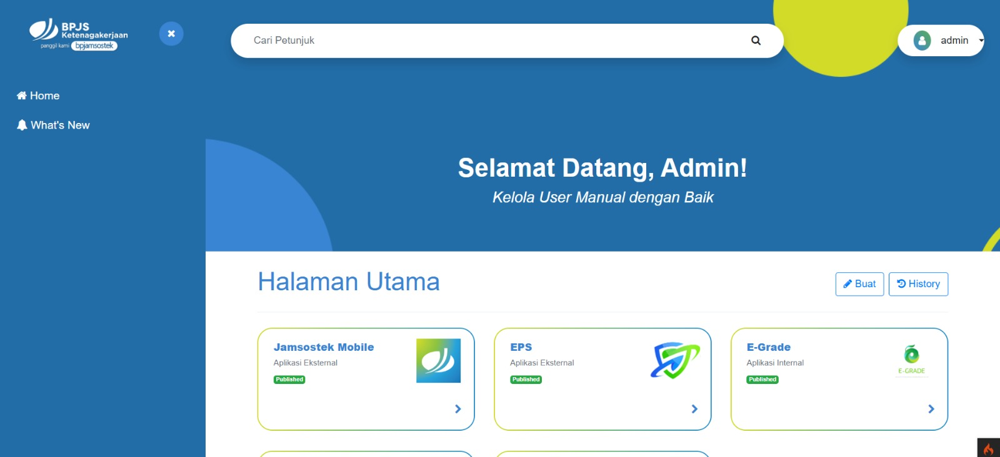
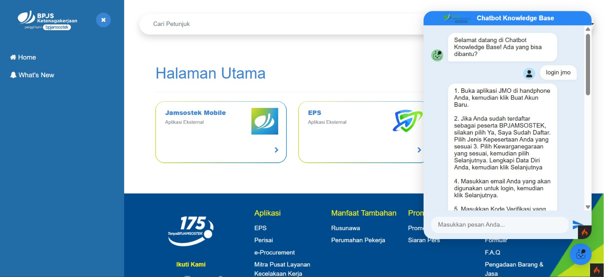

# BPJS Ketenagakerjaan Knowledge Base with AI Chatbot

A web-based **Knowledge Base** application designed to manage and distribute internal application user manuals for BPJS Ketenagakerjaan employees. This project integrates Content Management features (CRUD) with Artificial Intelligence (Chatbot) to enhance technical support efficiency.

## Key Features

### Admin (Management Side)
* **CRUD User Manual**: Admins have full control to Create, Read, Update, and Delete guidance documents.
* **Content Management**: Organized document management system to ensure easy information retrieval for employees.

### AI Chatbot Feature (User Side)
* **Automated Assistant**: Integrated with **Google Dialogflow API**, allowing users to inquire about application manuals using Natural Language.
* **Real-time Interaction**: Fast chatbot responses utilizing AJAX/Fetch API for a seamless and responsive user experience.

## Tech Stack
* **Framework**: CodeIgniter 4 (PHP 8.1+)
* **UI/UX**: Bootstrap 4 & JavaScript
* **Database**: MySQL
* **AI Engine**: Google Dialogflow (Natural Language Understanding)

## Instalasi & Konfigurasi

1. **Clone & Install**:
   ```bash
   git clone [https://github.com/username/knowledge-base.git](https://github.com/username/knowledge-base.git)
   composer install
   
2. **Environment Setup**
    * Copy the env file to .env
    * Configure your database settings and Google Cloud credential path: GOOGLE_APPLICATION_CREDENTIALS = "path/to/your/service-account-key.json"

3. **Database**:
    Import the database schema to MySQL and adjust the settings in your .env file
    
    
    ## Preview
    
    


## Disclaimer
This project was developed as part of an **internship program at BPJS Ketenagakerjaan** and was subsequently extended as a **Final Capstone Project (Thesis)**. 

Please note the following:
* **Data Privacy**: All sensitive information, internal documents, and private credentials have been removed. This repository uses **dummy data** or publicly available information for demonstration purposes only.
* **Non-Official**: This is a personal development version and is **not** the official production application of BPJS Ketenagakerjaan.
* **Educational Purpose**: The primary goal of this repository is to demonstrate technical proficiency in PHP (CodeIgniter 4) and AI integration (Dialogflow).
   